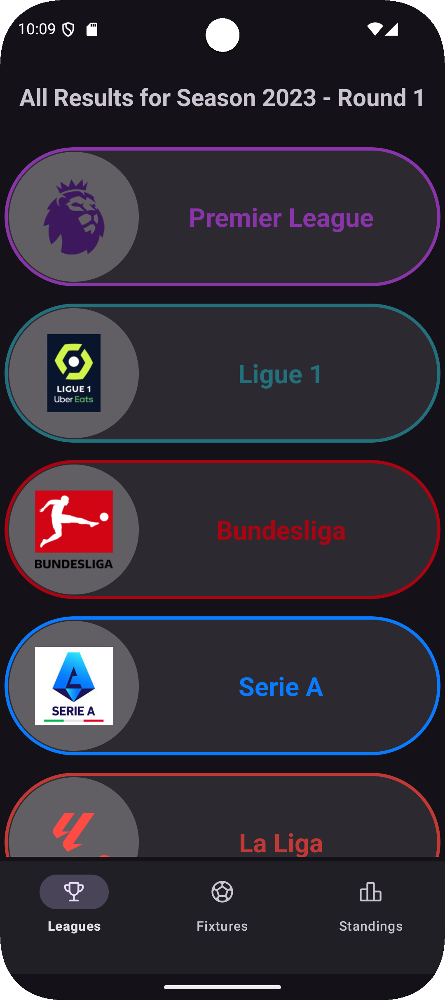
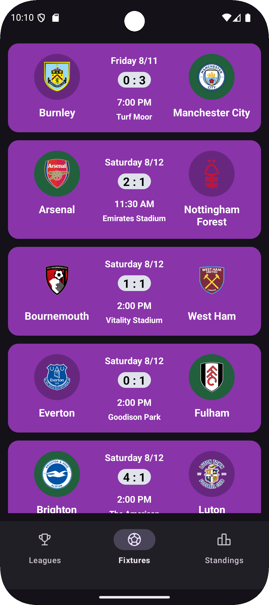
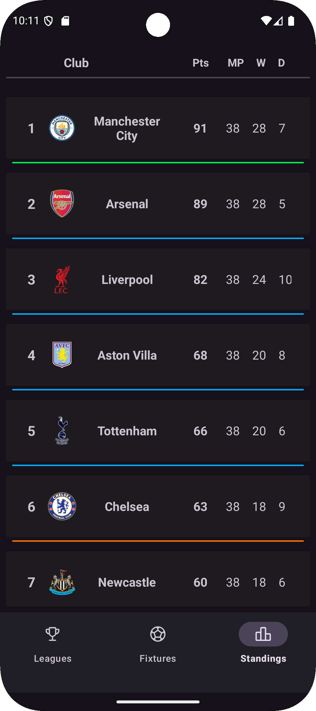
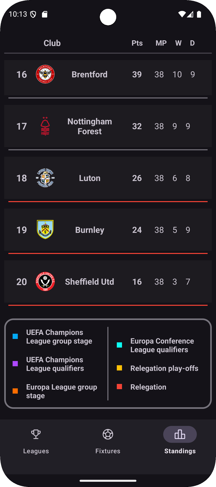

# ⚽ Matchify

**Matchify** is a modern Android sports application built using **Kotlin** and following the **MVVM architecture**. The app helps users stay up-to-date with top football leagues, upcoming fixtures **(limited to Round)**, and league standings **(2023 season only)**. It was developed as a personal training project with a focus on mastering **Retrofit** and related networking concepts in Android development.

---

## Features

- View **Top 5 Football Leagues** with logos and details
- Browse **upcoming fixtures** filtered by league
- Check **current league standings** with visual color-coded highlights
- **Dynamic UI styling** (e.g., different league stroke colors)
- **Navigation Component** with SafeArgs for fragment transitions
- Custom **Splash Screen** using Lottie animation
- Footer implementation in RecyclerView (first-time usage)

---

## Project Notes

- Fixtures are limited to **Round 1 only**, and standings reflect the **2023 season**, due to API access limitations

---

## Concepts Applied

- Retrofit with custom deserialization (Gson)
- Type converters & response modeling (**Custom Deserialization**)
- Jetpack Navigation Component + Safe Args
- LiveData and ViewModel (Lifecycle-aware)
- RecyclerView with dynamic styling and footer
- Animated SplashScreen (Lottie)
- Responsive UI design with ConstraintLayout, CardView, and more

---

## Tech Stack

- **Kotlin**
- **MVVM Architecture**
- **Retrofit + Gson Converter**
- **Jetpack ViewModel, LiveData**
- **RecyclerView + CardView**
- **Navigation Component**
- **Lottie for splash animation**
- **Glide for image loading**

---

## Setup & Installation

1. Clone the repository
```bash
git clone https://github.com/your-username/Matchify.git
```
2. Open the project in **Android Studio**
3. Sync Gradle and make sure the following dependencies exist in `build.gradle` (Module :app):

```kotlin
implementation(libs.retrofit)
implementation(libs.converter.gson)
implementation(libs.glide)
implementation(libs.androidx.lifecycle.viewmodel.ktx)
implementation(libs.androidx.lifecycle.livedata.ktx)
implementation(libs.kotlinx.coroutines.core)
implementation(libs.androidx.navigation.fragment)
implementation(libs.androidx.navigation.ui.ktx)
implementation(libs.lottie)
```
4. Add your **API key** from [API-Football](https://www.api-football.com/) to your constants or secrets file.

---

## Screenshots

> *(Insert screenshots here)*
- **League Selection Screen**  
  
  _Showcase of the Top 5 Leagues._

- ** Fixtures Screen** 
  
  _Showcase of the played fixtures._

- **Standings Table Screen**
  
  _Showcase of the standings of the league._

- **Standings Table Screen 2**
  
  _Showcase of the meanings of the standings dividers colors._

---

## Project Purpose
This app was built as a **personal learning project** to dive deep into:
- Networking using Retrofit
- Building scalable UI with RecyclerView
- Parsing nested JSON with custom deserialization
- Navigation and lifecycle-aware components
- Creating visually polished and maintainable apps

---

> ⚽ Built with passion by Mohamed Awadallah, fueled by football and Retrofit ☕
